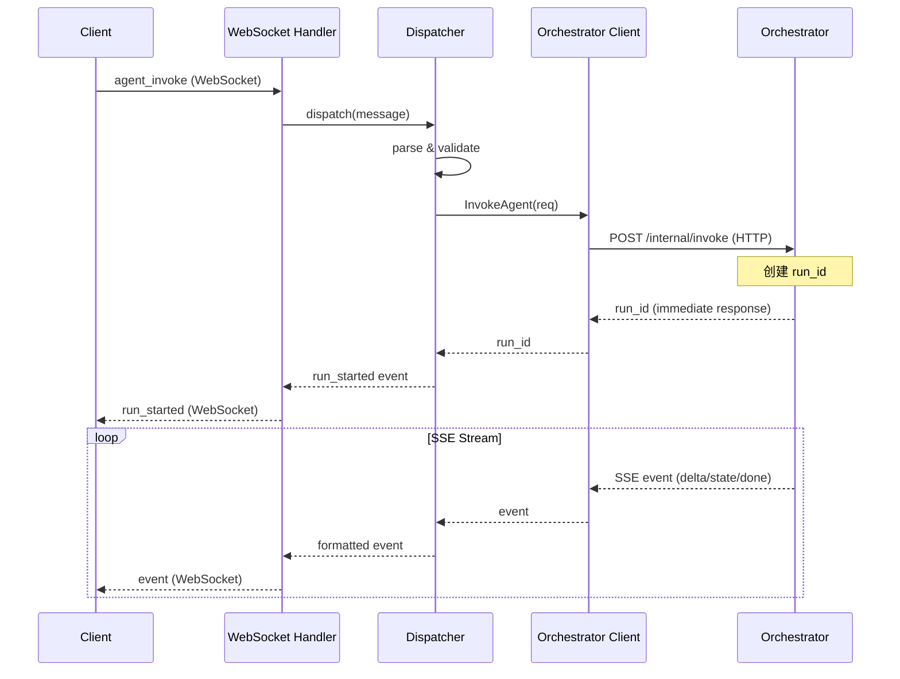
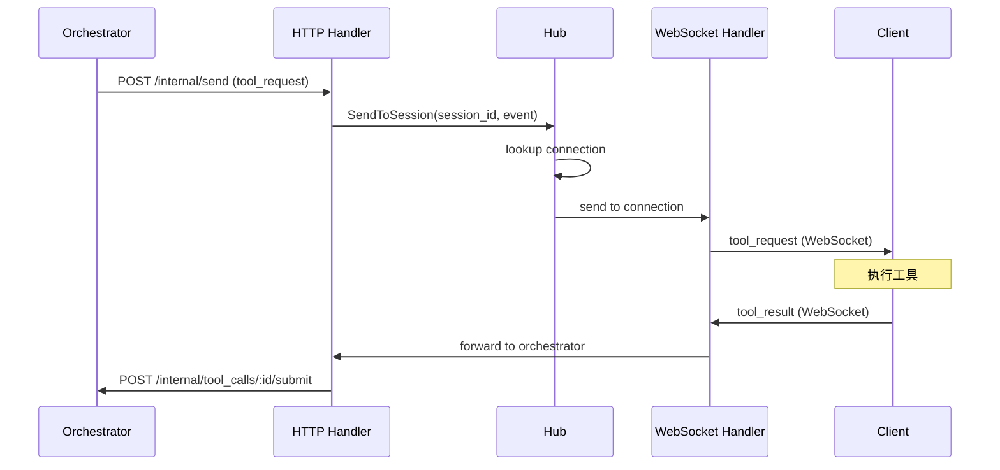

# Ingress (统一接入层) 实现文档 (MVP 版本)

## 概述

Ingress 是多 Agent 平台的统一接入层，负责对接外部通信通道（如 WebSocket、HTTP Webhook）与核心业务逻辑（Orchestrator）。它是平台与外部世界之间的桥梁，处理协议转换、连接管理和事件投递。

**核心定位**：`ingress` 负责接入与投递；`orchestrator` 负责路由与执行推进。

## 目录

1. [核心职责](#核心职责)
2. [架构设计](#架构设计)
3. [协议层设计](#协议层设计)
4. [连接管理](#连接管理)
5. [消息处理流程](#消息处理流程)
6. [与 Orchestrator 通信](#与-orchestrator-通信)
7. [数据模型](#数据模型)
8. [API 接口](#api-接口)
9. [错误处理与重试](#错误处理与重试)
10. [实施里程碑](#实施里程碑)

---

## 核心职责

根据 `ARCHITECTURE_MVP.md` 定义，Ingress 承担三项核心职责：

| 职责 | 说明 |
|------|------|
| 协议转换 | 把外部消息/任务转成 orchestrator 可执行的命令 |
| 通道对接 | 可对接 IM、WebSocket、HTTP Webhook、内部事件总线等 |
| 连接管理 | 负责推送 ACK、重连、离线补偿等通信职责 |

**关键边界**：Orchestrator 不承担连接管理、推送 ACK、重连、离线补偿等通信职责。

---

## 架构设计

### 目录结构

```
ingress/
├── main.go                              # 应用入口
├── internal/
│   ├── domain/                          # 领域模型
│   │   ├── message.go                   # 消息类型定义
│   │   ├── connection.go                # 连接模型
│   │   └── enums.go                     # 状态枚举
│   ├── service/                         # 业务逻辑
│   │   ├── hub.go                       # 连接中心（管理所有 WebSocket 连接）
│   │   ├── session.go                   # 会话管理
│   │   └── dispatcher.go                # 消息分发器
│   ├── adapter/                         # 外部适配器
│   │   └── orchestrator/
│   │       └── client.go                # Orchestrator HTTP 客户端
│   ├── transport/
│   │   ├── ws/                          # WebSocket 传输层
│   │   │   ├── server.go                # WebSocket 服务端
│   │   │   ├── connection.go            # 单个连接处理
│   │   │   └── message.go               # 消息序列化/反序列化
│   │   └── http/                        # HTTP API（供 Orchestrator 回调）
│   │       ├── server.go                # HTTP 服务入口
│   │       └── internal/
│   │           └── handler.go           # 内部 API 处理器
│   └── config/
│       └── config.go                    # 配置管理
└── go.mod
```

### 核心组件

1. **Hub（连接中心）** (`internal/service/hub.go`)
   - 管理所有 WebSocket 连接
   - 维护 session_id → connection 的映射
   - 支持向指定 session 推送消息

2. **Connection Handler（连接处理器）** (`internal/transport/ws/connection.go`)
   - 处理单个 WebSocket 连接的生命周期
   - 接收客户端消息并转发到 Dispatcher
   - 接收服务端推送并发送给客户端

3. **Dispatcher（消息分发器）** (`internal/service/dispatcher.go`)
   - 解析客户端消息类型
   - 调用 Orchestrator 对应 API
   - 将 Orchestrator 响应转换为客户端消息

4. **Orchestrator Client（协调者客户端）** (`internal/adapter/orchestrator/client.go`)
   - 封装与 Orchestrator 的 HTTP 通信
   - 处理 SSE 流式响应

### 架构图

```
                              ┌─────────────────────────────────────────┐
                              │              External World              │
                              └────────────────────┬────────────────────┘
                                                   │
                                     ┌─────────────┴─────────────┐
                                     │  WebSocket / HTTP Webhook │
                                     └─────────────┬─────────────┘
                                                   │
┌──────────────────────────────────────────────────┼──────────────────────────────────────────────────┐
│                                      INGRESS     │                                                   │
│                                                  ▼                                                   │
│  ┌─────────────────────────────────────────────────────────────────────────────────────────────┐    │
│  │                              Transport Layer (WebSocket Server)                              │    │
│  │  ┌───────────────┐  ┌───────────────┐  ┌───────────────┐  ┌───────────────┐                │    │
│  │  │  Connection 1 │  │  Connection 2 │  │  Connection 3 │  │  Connection N │                │    │
│  │  │  (session_1)  │  │  (session_2)  │  │  (session_3)  │  │  (session_N)  │                │    │
│  │  └───────┬───────┘  └───────┬───────┘  └───────┬───────┘  └───────┬───────┘                │    │
│  └──────────┼──────────────────┼──────────────────┼──────────────────┼────────────────────────┘    │
│             │                  │                  │                  │                              │
│             └──────────────────┼──────────────────┼──────────────────┘                              │
│                                ▼                  ▼                                                  │
│                   ┌────────────────────────────────────────────────┐                                │
│                   │                Hub (连接中心)                   │                                │
│                   │  session_id → connection mapping               │                                │
│                   │  broadcast / unicast                           │                                │
│                   └────────────────────────┬───────────────────────┘                                │
│                                            │                                                         │
│                                            ▼                                                         │
│                   ┌────────────────────────────────────────────────┐                                │
│                   │             Dispatcher (消息分发器)             │                                │
│                   │  - Protocol conversion                          │                                │
│                   │  - Message routing                              │                                │
│                   │  - Response formatting                          │                                │
│                   └────────────────────────┬───────────────────────┘                                │
│                                            │                                                         │
└────────────────────────────────────────────┼────────────────────────────────────────────────────────┘
                                             │
                                             │ HTTP (Internal API)
                                             ▼
                              ┌──────────────────────────────────────┐
                              │           ORCHESTRATOR               │
                              │  /internal/invoke                    │
                              │  /internal/tool_calls/:id/submit     │
                              │  /internal/approvals/:id/decide      │
                              └──────────────────────────────────────┘
```

---

## 协议层设计

### 客户端 → Ingress 消息

遵循 `ARCHITECTURE_MVP.md` 第 5.2 节定义的协议。

#### `hello` - 建立连接

```json
{
  "type": "hello",
  "ts": 1704067200000,
  "user_id": "u1",
  "api_key": "sk-xxx",
  "client_meta": {
    "app": "web",
    "version": "1.0.0"
  }
}
```

**处理流程**：
1. 验证 `api_key`（MVP 阶段使用静态 key）
2. 创建/恢复会话
3. 注册连接到 Hub
4. 返回 `hello_ack`

#### `agent_invoke` - 调用 Agent

```json
{
  "type": "agent_invoke",
  "ts": 1704067200000,
  "request_id": "req_abc123",
  "session_id": "sess_001",
  "agent_id": "agent_a",
  "message": {
    "role": "user",
    "content": "帮我查询今天的天气"
  }
}
```

**处理流程**：
1. 转换为 Orchestrator 内部调用格式
2. 调用 `POST /internal/invoke`
3. 接收 SSE 流并转发给客户端

#### `tool_result` - 提交工具执行结果

```json
{
  "type": "tool_result",
  "ts": 1704067200000,
  "run_id": "run_001",
  "tool_call_id": "tc_001",
  "ok": true,
  "result": {
    "file_path": "/tmp/screenshot.png"
  }
}
```

**处理流程**：
1. 调用 `POST /internal/tool_calls/:id/submit`
2. 返回确认或错误

#### `approval_decision` - 提交审批决策

```json
{
  "type": "approval_decision",
  "ts": 1704067200000,
  "run_id": "run_001",
  "approval_id": "ap_001",
  "decision": "approve",
  "reason": "已确认转账信息正确"
}
```

**处理流程**：
1. 调用 `POST /internal/approvals/:id/decide`
2. 返回确认或错误

#### `cancel_run` - 取消执行

```json
{
  "type": "cancel_run",
  "ts": 1704067200000,
  "run_id": "run_001"
}
```

**处理流程**：
1. 调用 `POST /internal/runs/:id/cancel`
2. 返回确认

### Ingress → 客户端消息

遵循 `ARCHITECTURE_MVP.md` 第 5.3 节定义的协议。

| 消息类型 | 说明 |
|----------|------|
| `hello_ack` | 连接确认（扩展字段，非架构文档定义） |
| `run_started` | 执行开始 |
| `delta` | 流式输出片段 |
| `state` | 状态变更 |
| `tool_request` | Client Tool 下发 |
| `approval_required` | 审批请求 |
| `error` | 错误 |
| `done` | 执行完成 |

---

## 连接管理

### 连接生命周期

```
┌─────────────┐
│   CREATED   │  ← WebSocket 连接建立
└──────┬──────┘
       │ hello 消息
       ▼
┌─────────────┐
│ AUTHENTICATING │  ← 验证 api_key
└──────┬──────┘
       │ 验证成功
       ▼
┌─────────────┐
│   ACTIVE    │  ← 正常通信状态
└──────┬──────┘
       │ 连接断开 / 超时
       ▼
┌─────────────┐
│   CLOSED    │  ← 连接关闭
└─────────────┘
```

### Connection 模型

```go
type Connection struct {
    ID          string          // 连接唯一标识
    SessionID   string          // 关联的会话 ID
    UserID      string          // 用户 ID
    State       ConnectionState // 连接状态
    Conn        *websocket.Conn // WebSocket 连接
    Send        chan []byte     // 发送队列
    CreatedAt   time.Time       // 创建时间
    LastPingAt  time.Time       // 最后心跳时间
    ClientMeta  json.RawMessage // 客户端元数据
}
```

### Hub 设计

```go
type Hub struct {
    // 所有活跃连接
    connections map[string]*Connection

    // session_id → connection_id 映射（支持多设备）
    sessionConns map[string]map[string]*Connection

    // 注册/注销通道
    register   chan *Connection
    unregister chan *Connection

    // 消息广播通道
    broadcast chan *BroadcastMessage

    // 定向推送通道
    unicast chan *UnicastMessage

    mu sync.RWMutex
}

// 向指定 session 推送消息
func (h *Hub) SendToSession(sessionID string, message []byte) error

// 向指定 run_id 关联的 session 推送消息
func (h *Hub) SendToRun(runID string, message []byte) error
```

### 心跳机制

```go
const (
    PingInterval = 30 * time.Second  // 心跳间隔
    PongWait     = 60 * time.Second  // 等待 pong 超时
    WriteWait    = 10 * time.Second  // 写入超时
)
```

**客户端需响应 WebSocket ping frame**，超时未响应则关闭连接。

### 离线处理（MVP 简化版）

MVP 阶段采用"立即失败"策略：

- 客户端离线时，tool_request 立即返回 `client_offline` 错误
- 不做消息缓存或离线补偿

后续可扩展：
- 短时间离线缓存（如 30s 内重连可恢复）
- 持久化队列 + 重连后投递

---

## 消息处理流程

### Agent 调用流程（详细时序）



### Tool Request 下发流程



---

## 与 Orchestrator 通信

### Orchestrator Client 接口

```go
type OrchestratorClient interface {
    // 调用 Agent（返回 SSE 流）
    InvokeAgent(ctx context.Context, req InvokeRequest) (<-chan Event, error)

    // 提交工具结果
    SubmitToolResult(ctx context.Context, toolCallID string, result ToolResultRequest) error

    // 提交审批决策
    SubmitApprovalDecision(ctx context.Context, approvalID string, decision ApprovalDecision) error

    // 取消执行
    CancelRun(ctx context.Context, runID string) error
}
```

### Invoke Agent 实现

```go
func (c *Client) InvokeAgent(ctx context.Context, req InvokeRequest) (<-chan Event, error) {
    // 1. 构造请求
    body := InvokeRequestBody{
        AgentID:   req.AgentID,
        SessionID: req.SessionID,
        Message:   req.Message,
    }

    // 2. 发送 HTTP 请求
    httpReq, _ := http.NewRequestWithContext(ctx, "POST",
        c.baseURL+"/internal/invoke",
        marshalJSON(body))
    httpReq.Header.Set("Accept", "text/event-stream")

    resp, err := c.client.Do(httpReq)
    if err != nil {
        return nil, err
    }

    // 3. 启动 goroutine 读取 SSE
    events := make(chan Event)
    go c.readSSE(resp.Body, events)

    return events, nil
}

func (c *Client) readSSE(body io.ReadCloser, events chan<- Event) {
    defer close(events)
    defer body.Close()

    reader := bufio.NewReader(body)
    for {
        line, err := reader.ReadString('\n')
        if err != nil {
            return
        }

        if strings.HasPrefix(line, "data:") {
            data := strings.TrimPrefix(line, "data:")
            var event Event
            json.Unmarshal([]byte(data), &event)
            events <- event
        }
    }
}
```

### Ingress 接收 Orchestrator 推送

Orchestrator 通过 HTTP 调用 Ingress 的内部 API 推送事件：

```go
// Ingress 侧 HTTP Handler
func (h *Handler) HandleSend(c echo.Context) error {
    var req SendRequest
    if err := c.Bind(&req); err != nil {
        return c.JSON(400, map[string]string{"error": "invalid request"})
    }

    // 查找 session 对应的连接并推送
    err := h.hub.SendToSession(req.SessionID, req.Event)
    if err != nil {
        return c.JSON(500, map[string]string{"error": err.Error()})
    }

    return c.JSON(200, map[string]string{"ok": "true"})
}
```

---

## 数据模型

### 消息类型定义

```go
// 基础消息结构
type BaseMessage struct {
    Type      string `json:"type"`
    Ts        int64  `json:"ts"`
    RequestID string `json:"request_id,omitempty"`
    SessionID string `json:"session_id,omitempty"`
    RunID     string `json:"run_id,omitempty"`
}

// 客户端 → 服务端
type HelloMessage struct {
    BaseMessage
    UserID     string          `json:"user_id"`
    APIKey     string          `json:"api_key"`
    ClientMeta json.RawMessage `json:"client_meta,omitempty"`
}

type AgentInvokeMessage struct {
    BaseMessage
    AgentID string  `json:"agent_id"`
    Message Message `json:"message"`
}

type ToolResultMessage struct {
    BaseMessage
    ToolCallID string          `json:"tool_call_id"`
    OK         bool            `json:"ok"`
    Result     json.RawMessage `json:"result,omitempty"`
    Error      string          `json:"error,omitempty"`
}

type ApprovalDecisionMessage struct {
    BaseMessage
    ApprovalID string `json:"approval_id"`
    Decision   string `json:"decision"` // "approve" | "reject"
    Reason     string `json:"reason,omitempty"`
}

// 服务端 → 客户端
type RunStartedEvent struct {
    BaseMessage
    AgentID string `json:"agent_id"`
}

type DeltaEvent struct {
    BaseMessage
    Text string `json:"text"`
}

type StateEvent struct {
    BaseMessage
    State  string          `json:"state"`
    Detail json.RawMessage `json:"detail,omitempty"`
}

type ToolRequestEvent struct {
    BaseMessage
    ToolCallID string          `json:"tool_call_id"`
    ToolName   string          `json:"tool_name"`
    Args       json.RawMessage `json:"args"`
    DeadlineTs int64           `json:"deadline_ts,omitempty"`
}

type ApprovalRequiredEvent struct {
    BaseMessage
    ApprovalID  string `json:"approval_id"`
    ToolCallID  string `json:"tool_call_id"`
    ToolName    string `json:"tool_name"`
    ArgsSummary string `json:"args_summary"`
}

type ErrorEvent struct {
    BaseMessage
    Code    string `json:"code"`
    Message string `json:"message"`
}

type DoneEvent struct {
    BaseMessage
    Usage UsageInfo `json:"usage"`
}
```

### 连接状态

```go
type ConnectionState string

const (
    ConnectionStateCreated        ConnectionState = "CREATED"
    ConnectionStateAuthenticating ConnectionState = "AUTHENTICATING"
    ConnectionStateActive         ConnectionState = "ACTIVE"
    ConnectionStateClosed         ConnectionState = "CLOSED"
)
```

---

## API 接口

### WebSocket 端点

```
ws://ingress:8090/ws
```

**连接流程**：
1. 客户端建立 WebSocket 连接
2. 客户端发送 `hello` 消息
3. 服务端验证后返回 `hello_ack`
4. 开始正常通信

### HTTP 内部 API（供 Orchestrator 调用）

#### `POST /internal/send` - 推送事件

```http
POST /internal/send
Content-Type: application/json

Request:
{
    "session_id": "sess_001",
    "event": {
        "type": "tool_request",
        "ts": 1704067200000,
        "run_id": "run_001",
        "tool_call_id": "tc_001",
        "tool_name": "browser.screenshot",
        "args": {"url": "https://example.com"}
    }
}

Response:
{
    "ok": true
}

Error Response (client offline):
{
    "ok": false,
    "error": "client_offline",
    "message": "session sess_001 has no active connections"
}
```

#### `GET /internal/sessions/:session_id/status` - 查询会话状态

```http
GET /internal/sessions/sess_001/status

Response:
{
    "session_id": "sess_001",
    "online": true,
    "connection_count": 1,
    "last_activity_at": 1704067200000
}
```

#### `GET /health` - 健康检查

```http
GET /health

Response:
{
    "status": "healthy",
    "connections": 42,
    "uptime_seconds": 3600
}
```

---

## 错误处理与重试

### 错误码定义

| 错误码 | 说明 | 客户端行为 |
|--------|------|------------|
| `invalid_message` | 消息格式错误 | 检查消息格式 |
| `auth_failed` | 认证失败 | 检查 api_key |
| `session_not_found` | 会话不存在 | 重新发送 hello |
| `client_offline` | 目标客户端离线 | 无法恢复 |
| `orchestrator_error` | Orchestrator 返回错误 | 可重试 |
| `internal_error` | 内部错误 | 联系管理员 |

### 重连策略

客户端实现建议：

```javascript
const RECONNECT_CONFIG = {
    maxRetries: 5,
    initialDelayMs: 1000,
    maxDelayMs: 30000,
    multiplier: 2.0
};

function reconnect(attempt) {
    const delay = Math.min(
        RECONNECT_CONFIG.initialDelayMs * Math.pow(RECONNECT_CONFIG.multiplier, attempt),
        RECONNECT_CONFIG.maxDelayMs
    );
    setTimeout(() => connect(), delay);
}
```

---

## 实施里程碑

### M0: 基础 WebSocket 通信

**目标**：建立 WebSocket 连接，实现 hello 握手

**任务清单**：

1. **项目初始化**
   - 创建 `ingress/` 目录结构
   - 初始化 `go.mod`
   - 添加依赖：`gorilla/websocket`、`labstack/echo/v4`

2. **连接管理**
   - 实现 `Hub` 结构体
   - 实现 `Connection` 结构体
   - 实现连接注册/注销逻辑

3. **WebSocket 服务**
   - 实现 WebSocket upgrade handler
   - 实现消息读取 goroutine
   - 实现消息发送 goroutine
   - 实现心跳检测

4. **Hello 握手**
   - 实现 `hello` 消息解析
   - 实现 API key 验证（静态 key）
   - 实现 `hello_ack` 响应

5. **HTTP 内部 API**
   - 实现 `POST /internal/send`
   - 实现 `GET /health`

**验收标准**：
- 客户端可建立 WebSocket 连接
- 发送 hello 后收到 hello_ack
- 心跳正常工作
- 可通过内部 API 推送消息到客户端

---

### M1: Agent 调用链路

**目标**：客户端可通过 Ingress 调用 Agent，接收流式输出

**任务清单**：

1. **Orchestrator Client**
   - 实现 HTTP 客户端基础结构
   - 实现 `POST /internal/invoke` 调用
   - 实现 SSE 流式响应读取

2. **Dispatcher**
   - 实现消息类型路由
   - 实现 `agent_invoke` 处理逻辑
   - 实现事件格式转换

3. **流式事件转发**
   - 将 SSE 事件转换为 WebSocket 消息
   - 实现 `run_started`、`delta`、`done` 事件转发

4. **run_id ↔ session_id 映射**
   - 实现 run 与 session 的关联
   - 支持按 run_id 查找 session

**验收标准**：
- 客户端发送 `agent_invoke` 后收到 `run_started`
- 持续收到 `delta` 流式输出
- 最终收到 `done` 事件

---

### M2: Client Tool 链路

**目标**：支持 Client Tool 下发与结果回收

**任务清单**：

1. **Tool Request 推送**
   - Orchestrator 调用 `/internal/send` 推送 `tool_request`
   - Ingress 转发到对应 session

2. **Tool Result 提交**
   - 实现 `tool_result` 消息解析
   - 调用 Orchestrator `/internal/tool_calls/:id/submit`

3. **离线处理**
   - 检测目标 session 是否在线
   - 离线时返回 `client_offline` 错误给 Orchestrator

4. **超时处理**
   - 支持 `deadline_ts` 字段
   - 超时后通知 Orchestrator

**验收标准**：
- 客户端收到 `tool_request`
- 客户端提交 `tool_result` 后 Agent 继续执行
- 客户端离线时 Orchestrator 收到错误

---

### M3: 审批链路

**目标**：支持审批请求下发与决策提交

**任务清单**：

1. **Approval Request 推送**
   - Orchestrator 推送 `approval_required` 事件
   - Ingress 转发到对应 session

2. **Approval Decision 提交**
   - 实现 `approval_decision` 消息解析
   - 调用 Orchestrator `/internal/approvals/:id/decide`

3. **状态同步**
   - 审批完成后推送 `state` 变更事件

**验收标准**：
- 客户端收到 `approval_required`
- 客户端提交审批决策后流程继续
- 拒绝时 Agent 收到 rejected 错误

---

### M4: 取消与错误处理

**目标**：完善取消执行和错误处理

**任务清单**：

1. **Cancel Run**
   - 实现 `cancel_run` 消息处理
   - 调用 Orchestrator `/internal/runs/:id/cancel`

2. **错误事件**
   - 实现 `error` 事件格式化
   - 实现错误码标准化

3. **连接异常处理**
   - 连接断开时清理 run 状态
   - 通知 Orchestrator 相关 run 需要取消

**验收标准**：
- 客户端可取消正在执行的 run
- 各类错误有统一的错误码和消息格式
- 连接断开时相关资源正确清理

---

### M5: 多设备与会话恢复

**目标**：支持同一 session 多设备连接，支持断线重连后恢复

**任务清单**：

1. **多设备支持**
   - 同一 session_id 可有多个连接
   - 事件广播到所有连接

2. **会话状态查询**
   - 实现 `/internal/sessions/:id/status` API
   - 返回在线状态和连接数

3. **重连后历史事件**（可选）
   - 短时间内缓存最近事件
   - 重连后补发缺失事件

**验收标准**：
- 同一用户多设备可同时收到消息
- 可查询 session 在线状态
- 短时间重连不丢失关键事件

---

## 配置项

| 配置项 | 默认值 | 说明 |
|--------|--------|------|
| `WS_PORT` | `8090` | WebSocket 端口 |
| `HTTP_PORT` | `8091` | 内部 HTTP API 端口 |
| `ORCHESTRATOR_URL` | - | Orchestrator 内部地址 |
| `WS_PING_INTERVAL_MS` | `30000` | WebSocket ping 间隔 |
| `WS_PONG_WAIT_MS` | `60000` | 等待 pong 超时 |
| `WS_WRITE_WAIT_MS` | `10000` | 写入超时 |
| `API_KEY` | - | 静态 API key（MVP 鉴权） |
| `LOG_LEVEL` | `info` | 日志级别 |

---

## Docker Compose 配置

```yaml
ingress:
  image: platform/ingress:latest
  ports:
    - "8090:8090"   # WebSocket
    - "8091:8091"   # Internal HTTP
  environment:
    - ORCHESTRATOR_URL=http://orchestrator:8081
    - API_KEY=sk-test-key
    - LOG_LEVEL=info
  depends_on:
    - orchestrator
  healthcheck:
    test: ["CMD", "curl", "-f", "http://localhost:8091/health"]
    interval: 10s
    timeout: 5s
    retries: 3
```

---

## 附录 A: 完整消息示例

### 成功调用 Agent 流程

```
# 1. 建立连接
CLIENT → SERVER: {"type":"hello","ts":1704067200000,"user_id":"u1","api_key":"sk-xxx"}
SERVER → CLIENT: {"type":"hello_ack","ts":1704067200001,"session_id":"sess_001"}

# 2. 调用 Agent
CLIENT → SERVER: {"type":"agent_invoke","ts":1704067200100,"request_id":"req_001","session_id":"sess_001","agent_id":"agent_a","message":{"role":"user","content":"你好"}}
SERVER → CLIENT: {"type":"run_started","ts":1704067200101,"request_id":"req_001","run_id":"run_001","session_id":"sess_001","agent_id":"agent_a"}
SERVER → CLIENT: {"type":"delta","ts":1704067200200,"run_id":"run_001","text":"你好"}
SERVER → CLIENT: {"type":"delta","ts":1704067200300,"run_id":"run_001","text":"！有什么"}
SERVER → CLIENT: {"type":"delta","ts":1704067200400,"run_id":"run_001","text":"可以帮你的？"}
SERVER → CLIENT: {"type":"done","ts":1704067200500,"run_id":"run_001","usage":{"total_tokens":50,"duration_ms":500}}
```

### Client Tool 流程

```
# 1. 收到工具请求
SERVER → CLIENT: {"type":"tool_request","ts":1704067200000,"run_id":"run_001","tool_call_id":"tc_001","tool_name":"browser.screenshot","args":{"url":"https://example.com"},"deadline_ts":1704067260000}

# 2. 提交结果
CLIENT → SERVER: {"type":"tool_result","ts":1704067210000,"run_id":"run_001","tool_call_id":"tc_001","ok":true,"result":{"file_path":"/tmp/screenshot.png"}}

# 3. 继续执行...
SERVER → CLIENT: {"type":"delta","ts":1704067210100,"run_id":"run_001","text":"截图已完成"}
```

### 审批流程

```
# 1. 收到审批请求
SERVER → CLIENT: {"type":"approval_required","ts":1704067200000,"run_id":"run_001","approval_id":"ap_001","tool_call_id":"tc_001","tool_name":"payments.transfer","args_summary":"转账 ¥100 到账户 xxx"}

# 2. 提交审批决策
CLIENT → SERVER: {"type":"approval_decision","ts":1704067210000,"run_id":"run_001","approval_id":"ap_001","decision":"approve","reason":"已确认转账信息正确"}

# 3. 继续执行...
SERVER → CLIENT: {"type":"state","ts":1704067210100,"run_id":"run_001","state":"RUNNING","detail":{}}
```
